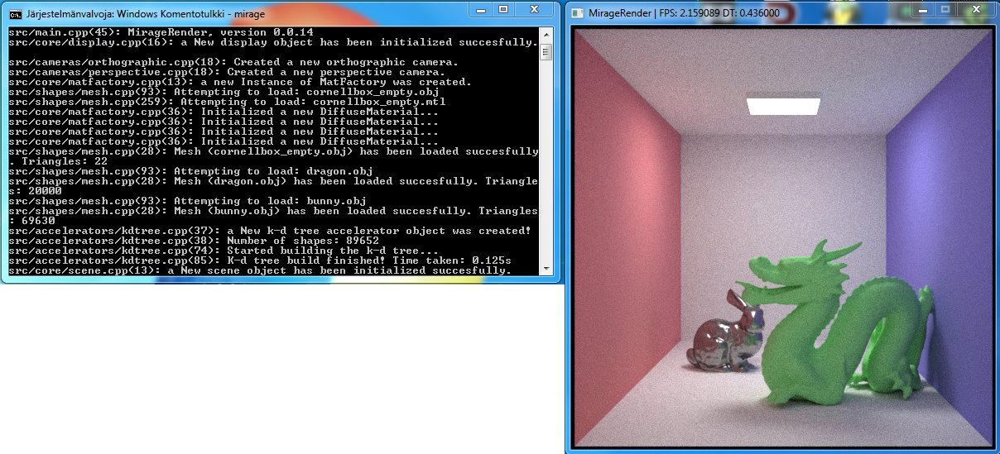

Mirage Render
======

Mirage Render is a 3d renderer that aims for photorealistic results. Currently the software is in very early stage.

Example images
--------------

_a Simple cornell box scene rendered using monte carlo path tracing._