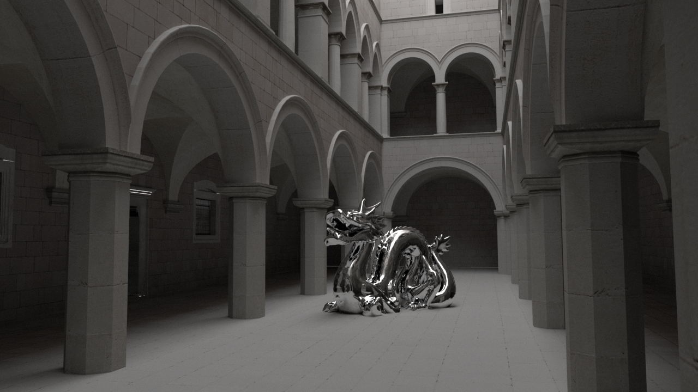
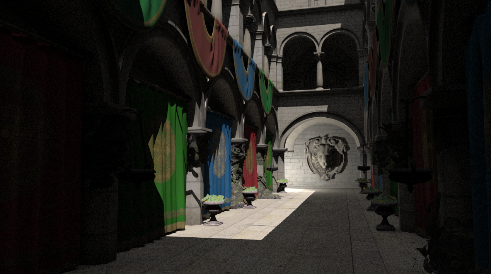
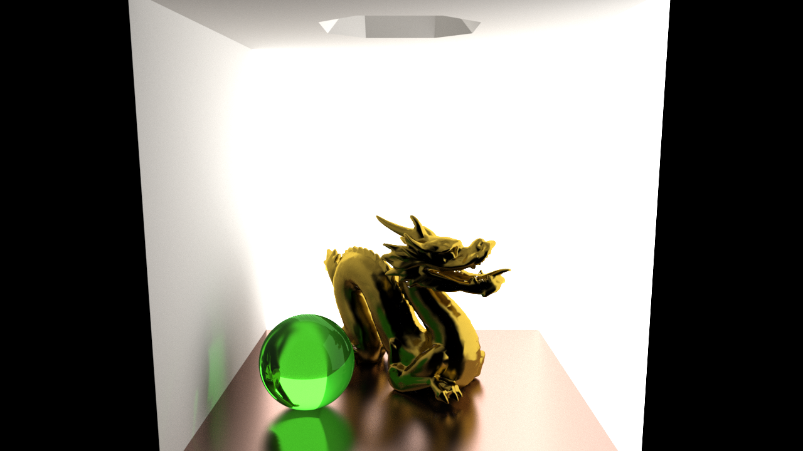
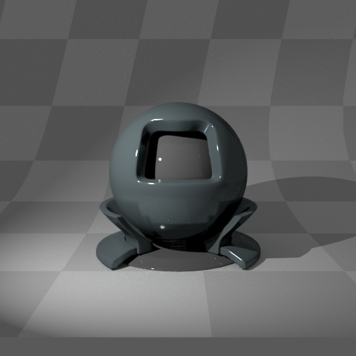
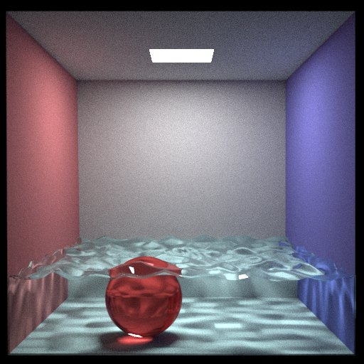

Mirage Render
======

Mirage Render is a 3d renderer that aims for photorealistic results. Currently the software is in very early stage.

Build status and downloads
------------
| Build status | Build downloads |
| ------------ | --------------- |
| [](http://harha.us.to:8080/job/MirageRender_Linux_build/) | [Linux x64](http://harha.us.to/jenkins/MirageRender_Linux/) |
| [](http://harha.us.to:8080/job/MirageRender_Windows_build/) | [Windows x64](http://harha.us.to/jenkins/MirageRender_Windows/) |

Usage
-----

```
mirage --help
LOG | Main: MirageRender, version 0.0.28
LOG | Usage: mirage.exe --script scriptfilename.lua, folder for scripts is ./res/scripts/
      Available launch parameters:
      Show this help message: --help, -h
      Load a scene file: --script, -s
LOG | Main: atexit(dispose) Hook called.
```

Example images
--------------



_a Dabrovic sponza scene rendered with indirect illumination._



_a Crytek sponza scene rendered with direct and indirect illumination._



_a Cornell box scene with a glossy metallic floor, a golden dragon and two room surfaces acting as light sources._



_a Mitsuba sphere, spot light source and a diffuse texture applied on the floor mesh._



_a Cornell box scene rendered using monte carlo path tracing, caustics caused by water, indirect illumination._


_a Cornell box scene rendered using monte carlo path tracing, direct & indirect illumination._