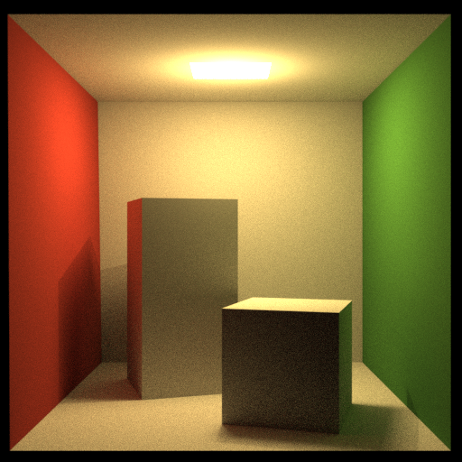

Mirage Render
======

Mirage Render is a 3d renderer that aims for photorealistic results. Currently the software is in very early stage.

Example images
--------------

_a Cornell box scene rendered using monte carlo path tracing, caustics caused by water, indirect illumination._

_a Cornell box scene rendered using monte carlo path tracing, direct & indirect illumination._